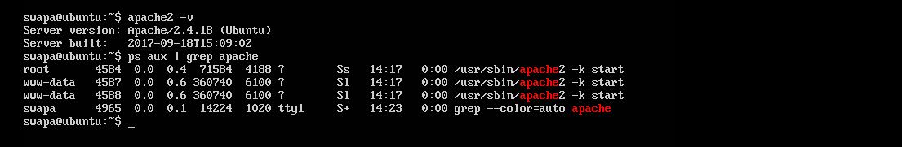
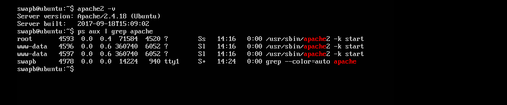
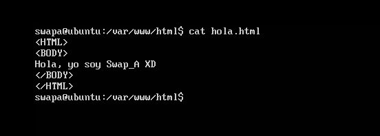
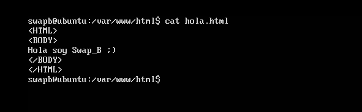
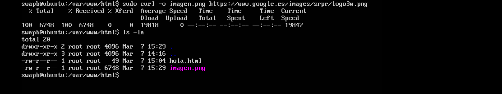
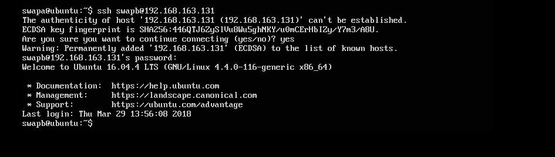
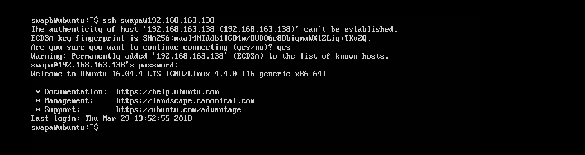
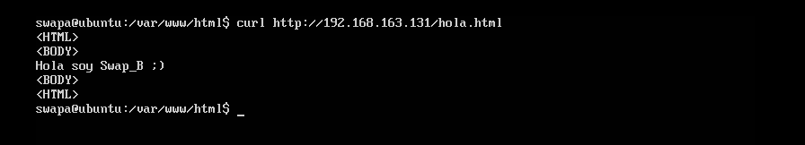
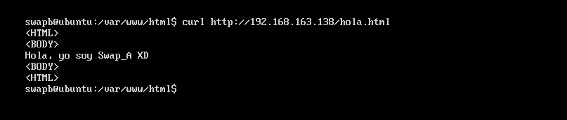

# Práctica 1. Preparación de las herramientas
### Por Adrián Gabriel Gámez López

Tras seguir todos los pasos de instalación de herramientas tales como:
*sudo apt-get install apache2 mysql-server mysql-client*

y tras comprobar que el servidor apache está instalado, en ambas máquinas

Por último instalaremos las herramientas curl y ssh
*sudo apt-get install curl ssh*

y crearemos en cada máquina un arquivo HTML en el directorio var/www/html llamado hola.html

Y podemos comprobar que tenemos conexiona a internet y funciona el curl descargando una imagen

## Cuestiones a resolver

1. acceder por ssh de una máquina a otra
De swapa a swapb

De swapb a swapa

2. acceder mediante la herramienta curl desde una máquina a la otra
De swapa a swapb

De swapb a swapa

