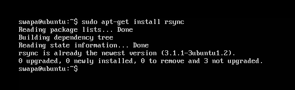
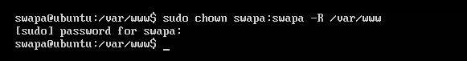
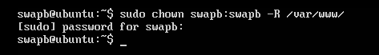
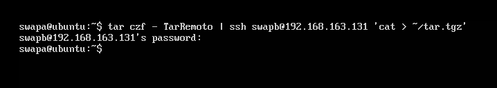
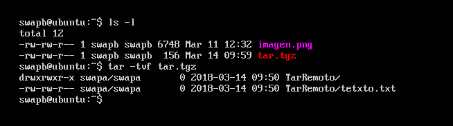
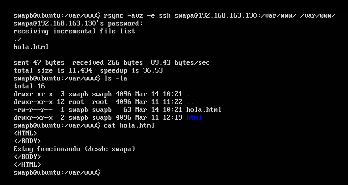
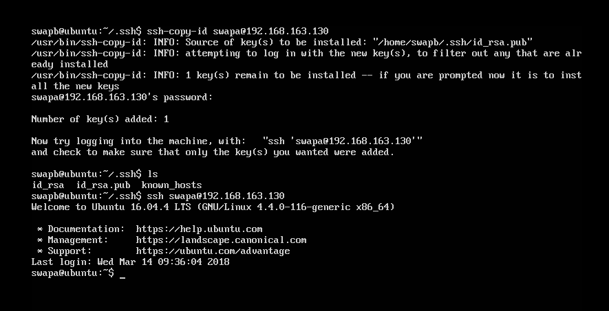
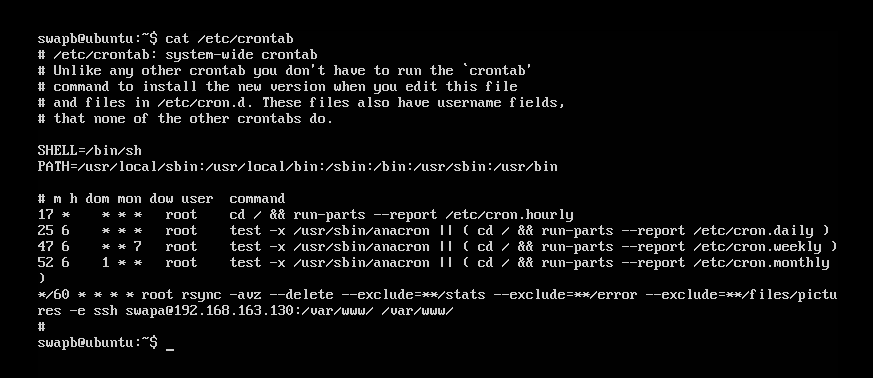

# Práctica 2. Clonar la información de un sitio web
### Por Adrián Gabriel Gámez López

Es necesario instalar la herramienta rsync:

Y decidí trabajar como usuario regular sin privilegios por lo que tengo que hacer a cada usuario dueño de su 

carpeta /var/www donde residen los archivos web:

## Cuestiones a resolver ##

1. probar el funcionamiento de la copia de archivos por ssh

Creamos un directorio TarRemoto, con un archivo texto.txt, por ejemplo:

Luego ejecutamos el siguiente comando para empaquetarlo en un tar y mandarlo a un equipo remoto mediante ssh:

Como podemos comprobar, en el equipo destino tenemos un archivo ".tar" tque contiene el directorio TarRemoto:

2. clonado de una carpeta entre las dos máquinas

Ahora clonaremos la carpeta /var/www/ de la máquina swapa en swapb y comprobamos que el archivo hola.html era, como podemos comprobar, exactamente el que había en swapa, ya que en el texto describía que era de la otra máquina.

3. configuración de ssh para acceder sin que solicite contraseña

con ssh-keygen -b 4096 -t rsa generamos una clase pública, damos permisos a dicha clave con chmod 600 ~/.ddh/authorized_keys.
Finalmente usamos el comando ssh-copy-id, para así copiar la clave a la máquina principal swapa: 

Como podemos comprobar, al final hemos establecido conexión ssh sin necesidad de volver a introducir la contraseña de swapa.

4. establecer una tarea en cron que se ejecute cada hora para mantener actualizado el contenido del directorio /var/www entre las dos máquinas 
Modificamos el archivo /etc/crontab de forma que cada */60 minutos (cada hora) ejecute el comando rsync -avz -e por ssh pero excluyendo /var/www/error, /var/www/stats y /var/www/files/pictures
