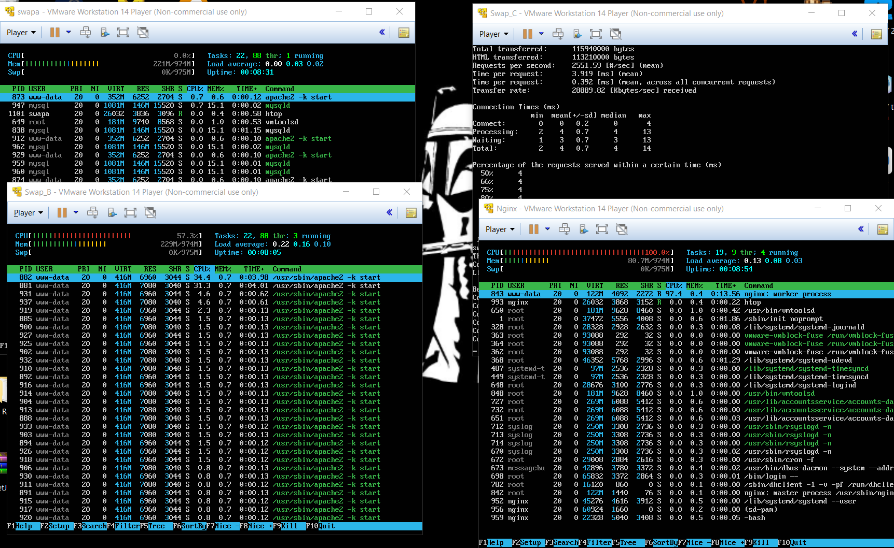
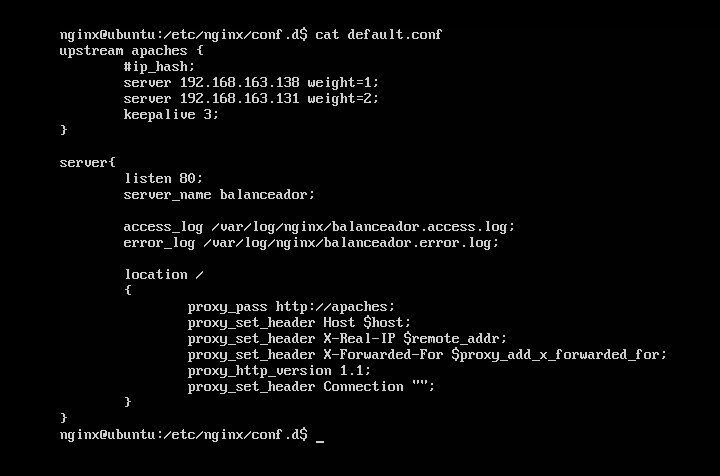
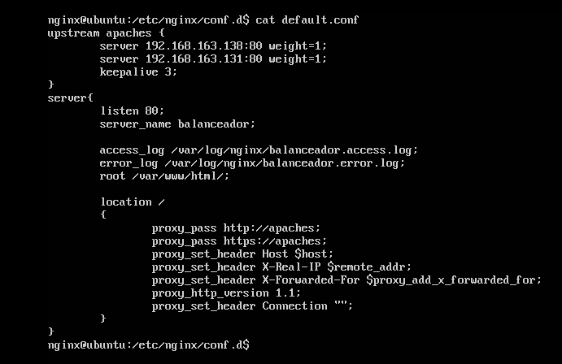
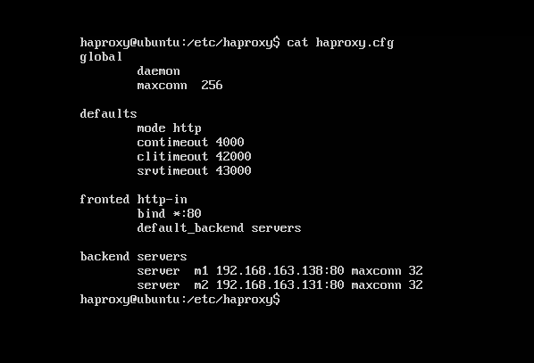
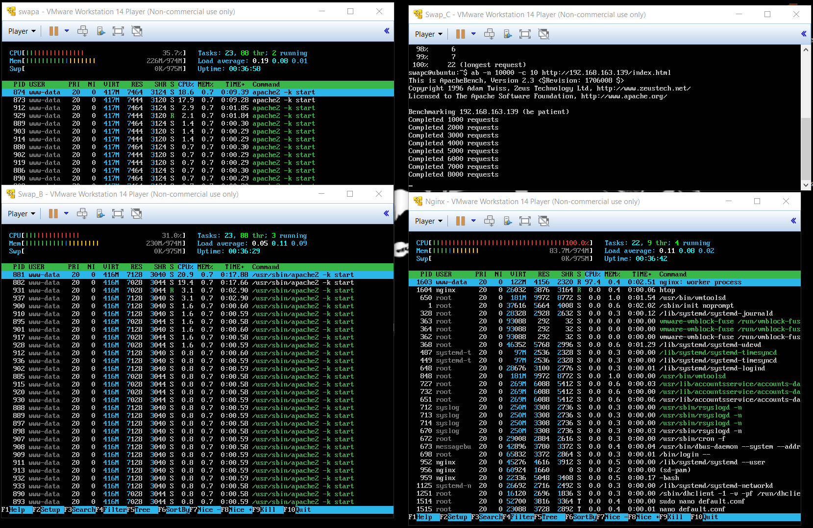
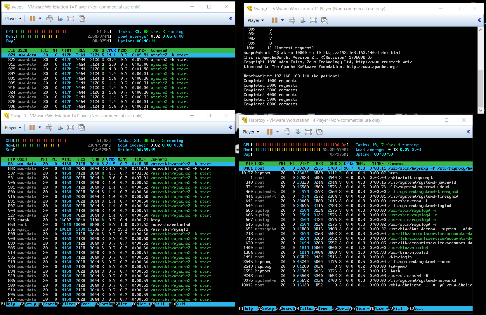

# Práctica 2. Clonar la información de un sitio web
### Por Adrián Gabriel Gámez López

Para el desarrollo de esta práctica opté por generar dos máquinas virtuales, las cuales no tengan el puerto 80 ocupado, es decir sin haber instalado apache.
Una con usuario nginx e ip: 192.168.163.139 con nginx
Otra con usuario haproxy de ip:192.168.163.140 que por su parte usará haproxy

## Cuestiones a resolver ##

1. configurar una máquina e instalar el nginx como balanceador de carga

El servidor nginx fue el que más problemas me dio a la hora de configurarlo, ya que al principio no me balanceaba la carga como es debido:

Su configuración era la siguiente en un inicio:

Tras la ayuda de Daniel, el profesor de prácticas pudimos descubrir que el problema residia a la hora de usar ip_hash y que me faltaba haber seleccionado un root, por lo que finalmente para que funcionase, la configuración de nginx quedó tal que así:

También se comentó la línea que configura ngnix como servidor web en el archivo /etc/nginx/nginx.conf de antemano para prevenir error.

Así que finalmente, la confuración quedaría como máquinas servidoras para balancear la carga 192.168.163.138 (máquina 1) y la 192.168.163.131 (máquina 2) con el mismo reparto de carga 1/1 y 3 segundos de keepalive.

2. configurar una máquina e instalar el haproxy como balanceador de carga

La configuaración del balanceador haproxy fue mucho más sencillo puesto al seguir los pasos básicos que aparecen en el guión ya funcionaba correctamente para las dos máquinas servidoras utilizadas.

3. someter a la granja web a una alta carga, generada con la herramienta Apache Benchmark, teniendo primero nginx y después haproxy. 
Finalmente desde la máquina 3 se genera una gran carga de peticiones a los servidores que a través del balanceador distribuje ese esfuerzo.

