# Práctica 2. Clonar la información de un sitio web #
### Por Adrián Gabriel Gámez López ###

## Cuestiones a resolver ##

1. Crear e instalar en la máquina1 un certificado SSL autofirmado para configurar el acceso HTTPS a los servidores. Una vez configurada la máquina 1, se debe copiar al resto de máquinas servidoras y al balanceador de carga. Se debe configurar nginx adecuadamente para aceptar y balancear correctamente tanto el tráfico HTTP como el HTTPS

El certificado lo generaré en la máquina1 cuyo usuario es swapa.
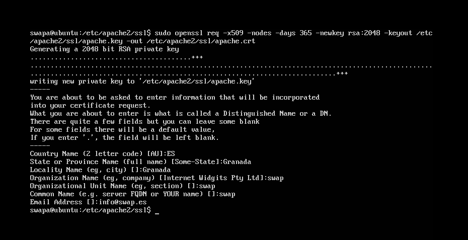

Luego se incluyen las siguientes lineas de código al archivo de configuracion generado en default-ssl.
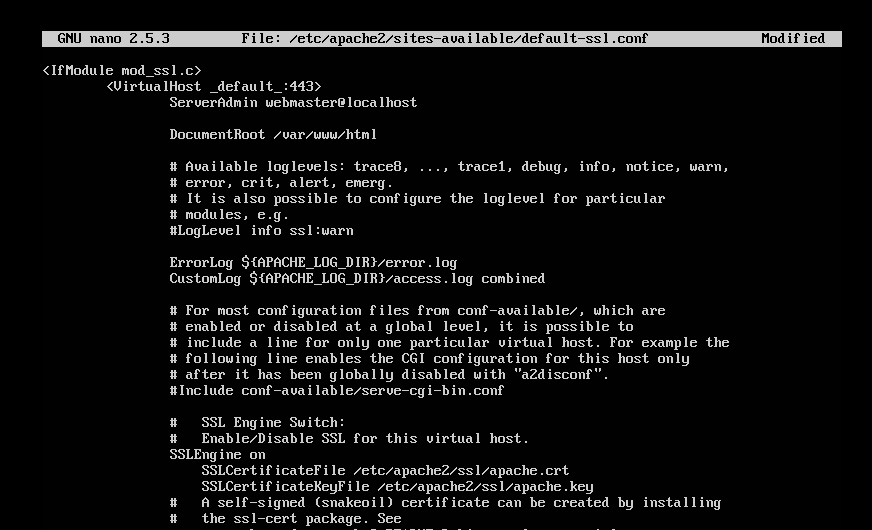

Lo activamos y reinicamos apache. Ahora sólo queda pasar este mismo cretificado a la otra máquina y al balanceador.
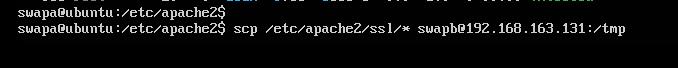
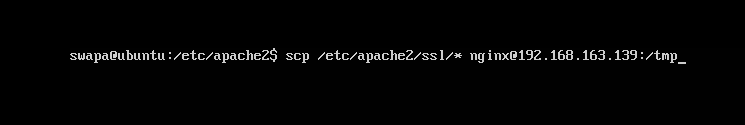

Finalmente queda configurar nginx como balanceador de carga con certificados SSL:
Esta parte fue la que más prabajo me costó y la que dio algunos problemas, ya que en sí no es muy complejo, no viene especificado en el guion como se debe realizar.

Como podemos ver, le decimos al balanceador que escuche en el puerto 443 mesajes ssl, activamos el servicio seguro y le pasamos los certificados que copiamos de la máquina1.
Opcionalmente puse que usara el protocolo TLS version 1.

Podemos comprobar que desde un navegador podemos acceder a estas páginas con servicio seguro.
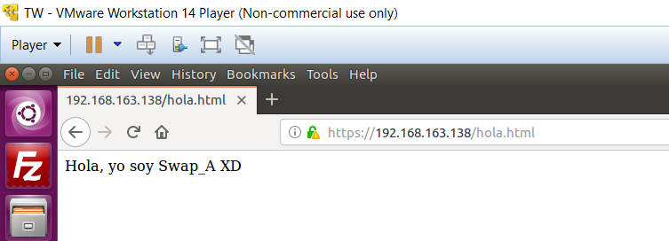
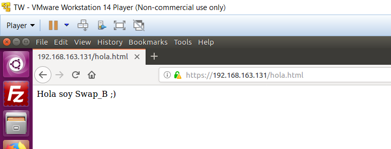

Y también el balanceador es accesible a estas páginas seguras:
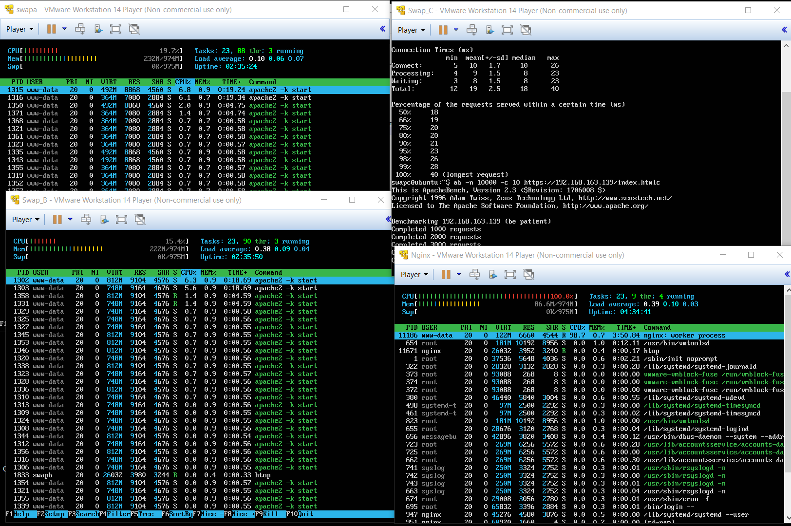

2. Configurar las reglas del cortafuegos con IPTABLES para asegurar el acceso a uno de los servidores web, permitiendo el acceso por los puertos de HTTP y HTTPS a dicho servidor. Esta configuración se hará en una de las máquinas servidoras finales (p.ej. en la máquina 1), y se debe poner en un script con las reglas del cortafuegos que se ejecute en el arranque del sistema (según la versión de Linux, se llevará a cabo de una forma u otra).

Crearé un script llamado "basico.sh" dónde tiene una configuracion básica para limitar tráfico a dicho servidor en el que esté alojado, en mi caso estará en la máquina1 (swapa).
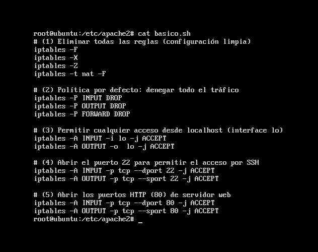

También es conveniente crear otro que resetee la configuración del mismo cortafuegos por si hemos cometido algún fallo anterior.
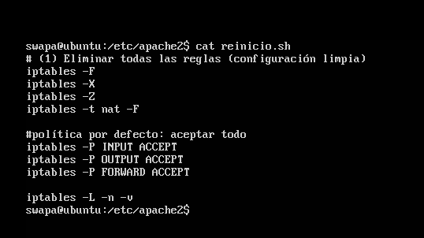

Como podemos comprobar tras iniciar el contafuegos en la máquina1 no tenemos el acceso que teníamos antes y que por su parte la máquina2 si.

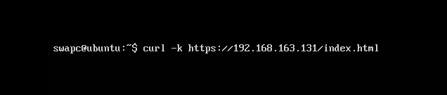
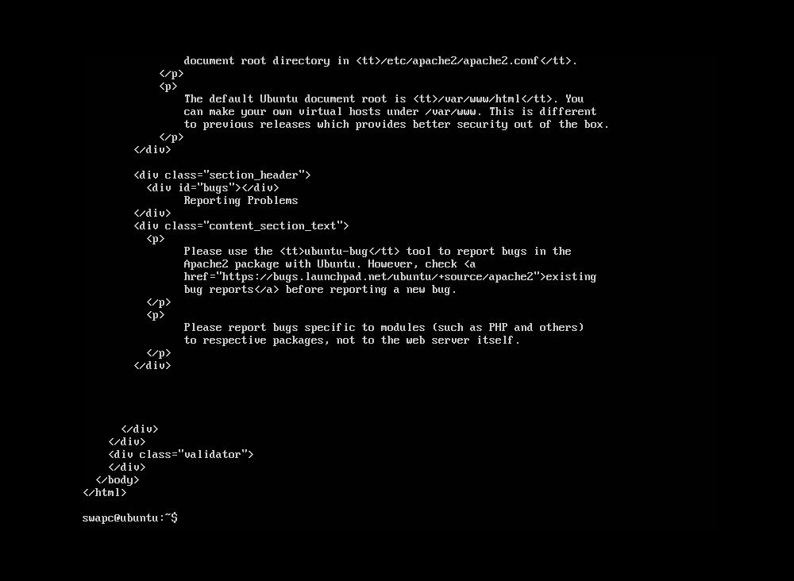