# Práctica 5. Replicación de bases de datos MySQL #
### Por Adrián Gabriel Gámez López ###

## Cuestiones a resolver ##

1. Crear una BD con al menos una tabla y algunos datos

Creamos la base de datos de nombre contactos, cuya creación no aparece en la captura ya que cuando la creé no tomé la captura conveniente.
Posteriormente ya si podemos ver como inserto una tupla "nombre-telefono" en dicha base de datos, que previamente muestro una y la única tabla existente en ella y podemos ver que ha sido añadida a la misma. Finalmente podemos ver los valores de los datos de la mista, como su tipo, si son clave primaria, externa...etc
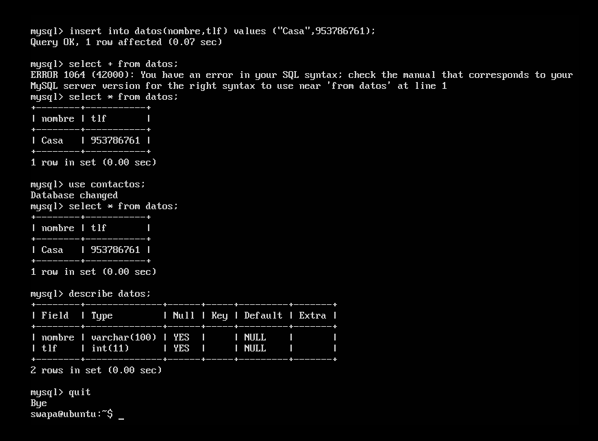

2. Realizar la copia de seguridad de la BD completa usando mysqldump en la máquina principal y copiar el archivo de copia de seguridad a la máquina secundaria.

La herramienta mysqldump viene integrada en la instalacion de MySQL puesto que directamnete podemos utilizarla sin necesidad de instalar nada más. Antes de todo tenemos que restringir el acceso a dicha base de datos para que no sea actualizada mientras realizamos la copia:

Y a continuación realizamos la copia de la siguiente manera, y reactivando al terminar el acceso a la BD.
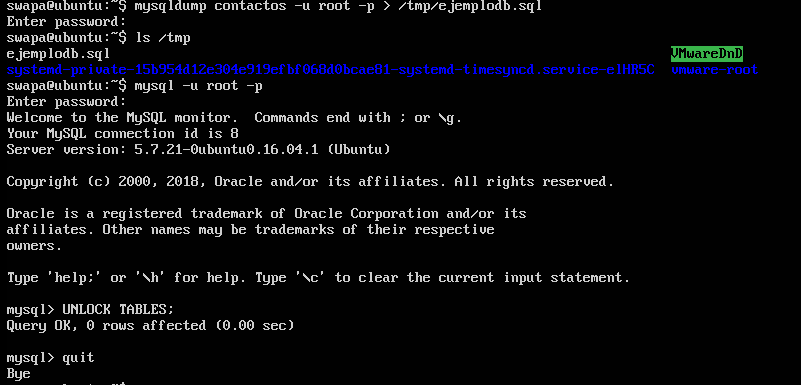

A continuación copiamos esta copia en la máquina2, la cual queremos que contenga esa copia.

Pero antes de restaurarla, debemos asegurarnos de que la base de datos existe internamnete en la máquina, si no es así se crea de igual manera que se creó la primera:
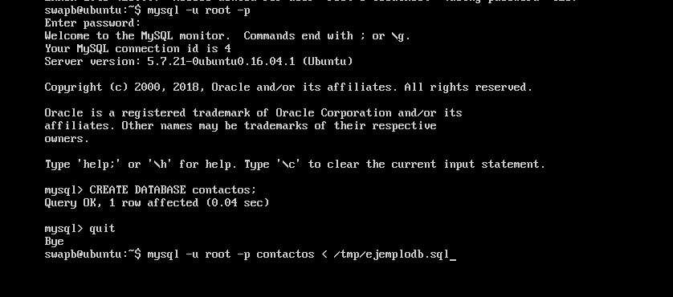

3. Restaurar dicha copia de seguridad en la segunda máquina (clonado manual de la BD), de forma que en ambas máquinas esté esa BD de forma idéntica. 

Una vez que se complete la trasferencia y sabiendo que existe la base de datos a copiar, será tan sencillo como importar dentro de esa BD la copia generada.
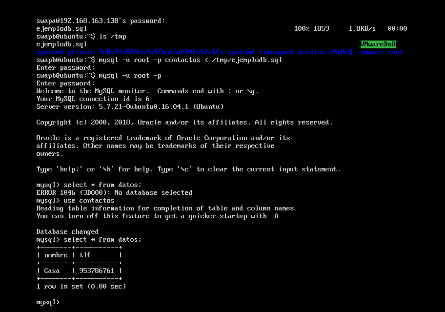

4. Realizar la configuración maestro-esclavo de los servidores MySQL para que la replicación de datos se realice automáticamente.

Primero estaría de más comprobar la versión de MySQL que tenemos, ya ue esto será un factor para hacer el sistema M-S de una forma u otra:
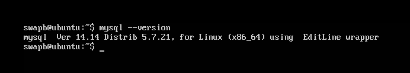

A continuación, en la máquina que será el maestro debemos configurar el archivo /etc/mysql/my.cnf tal y como se explica:
Comentamos el parámetro bind-address, le indicamos el archivo donde almacenar el log de errores, establecemos el identificador del servidory asignamos el registro binario:
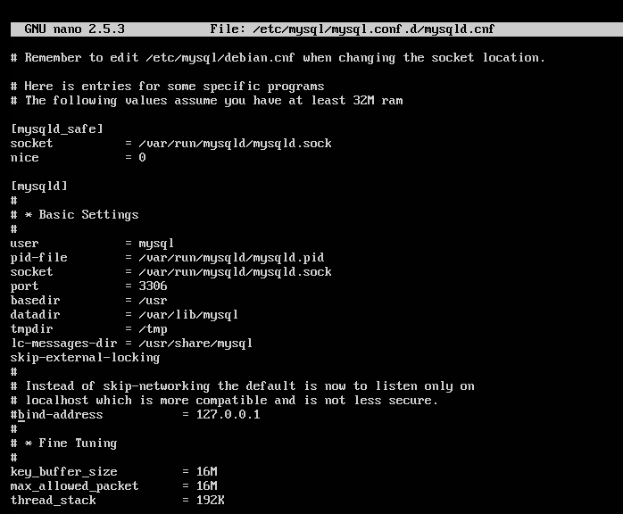
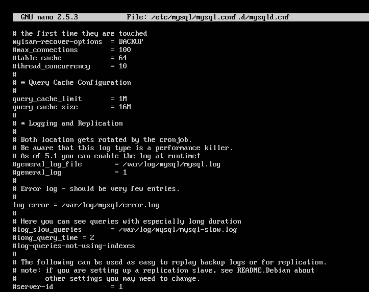
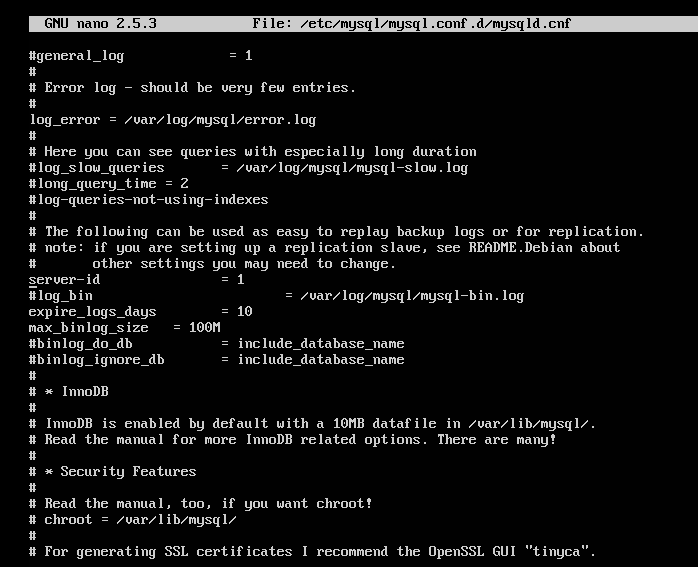
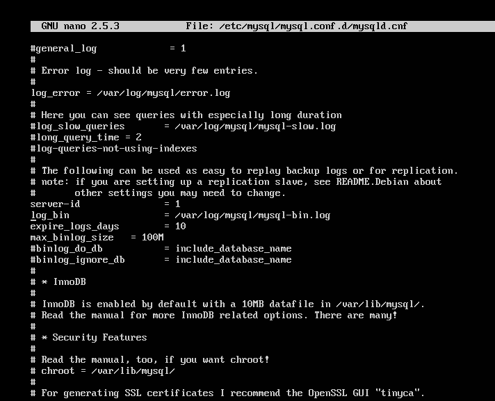

Finalmente guardamos y reiniciamos el servicio.
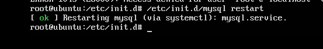

Ahora lo que necesitamos hacer es crear un usuario en el maestro y darle permisos de acceso para la replicación, también como paso final debemos conocer los datos de la BD a replicar para usarlos en el esclavo, muy importante la "Position".
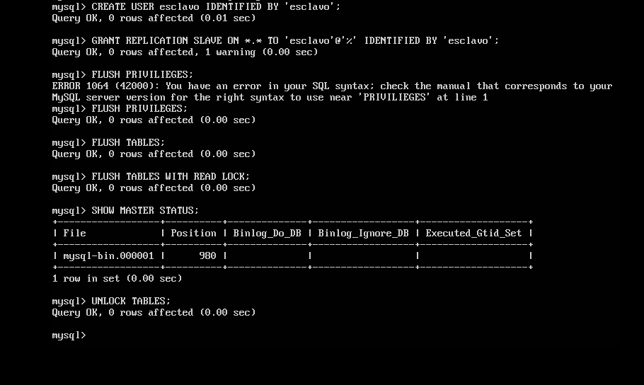

Falta la configuración del esclavo y habremos terminado, tal y como vemos y debido a que nuestra versión de MySQL es posterior a la 5.5, con los valores de IP del maestro y el dato de Posición.

Y como hago al final, arranco el esclavo.

Un paso a destacar, es que durante todo este proceso se deben bloquear el acceso a la base de datos maestra para que no haya ningún problema de inserciones y modificaciones inesperadas, por lo que una vez terminado todo esto y haber puesto a funcionar el esclavo deberíamos desbloquearlas, pero en mi caso fue un detalle que se me pasó, pero como en ningún momento yo inserté nada en el maestro no se produjo ningún error.

Como modo final de revisión, podemos cercenarnos de que el estado del esclavo es óptimo si en su SHOW SLAVE STATUS\G el parámetro "Seconds_Behind_Master” es distinto de “null".

Y como podemos ver al insertar valores en la BD maestra se modifican de forma remota la BD esclava.
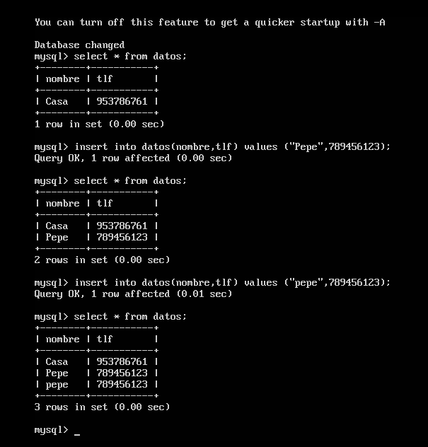
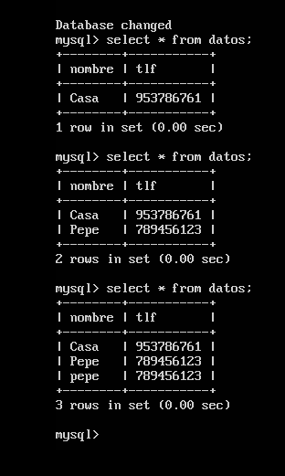